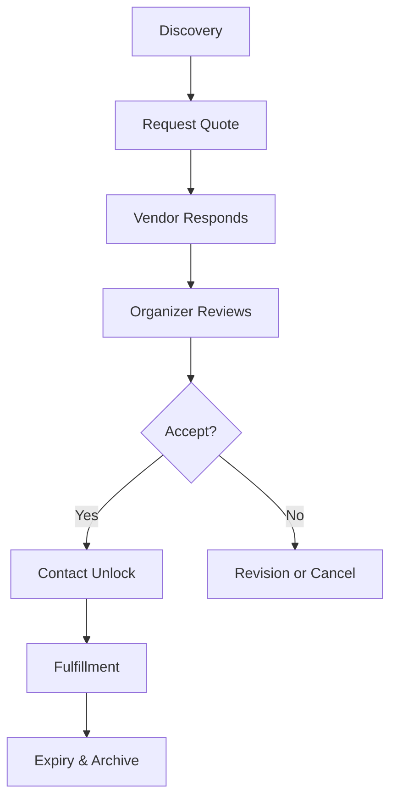
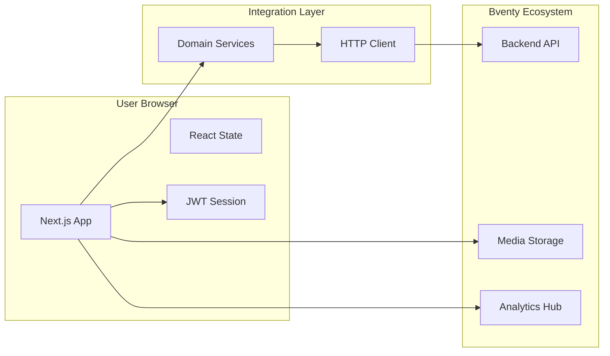

# Bventy Interface

Official Site: [bventy.com](https://bventy.com)
License: [AGPL-3.0](LICENSE)
Trademark Policy: [TRADEMARK.md](TRADEMARK.md)

## The Bventy Platform

Bventy is a structured marketplace platform designed to improve how event organizers and service vendors connect. 

This repository contains the interface layer, a Next.js application that provides a calm, deliberate experience for finding vendors, managing quote requests, and finalizing event details. We prioritize accessibility and performance to ensure a smooth professional interaction.

### The Role of the Interface

In many existing platforms, communication is often chaotic. The Bventy interface provides a framework where requirements are clarified through structured forms and dashboards. This reduces the cognitive load for both organizers and vendors, allowing them to focus on the technical details of the event.

---

## Design Principles

Our interface is guided by six core principles that define the user experience.

1.  **Gated communication**: Contact details are protected until a quote is explicitly accepted.
2.  **Structured quote workflow**: A predictable sequence of steps from request to fulfillment.
3.  **Vendor dignity**: Providing vendors with the context they need to price their services fairly.
4.  **Contact expiry by design**: Communication channels automatically close when their purpose is fulfilled.
5.  **Privacy-first architecture**: Data collection is limited to what is necessary for platform operations.
6.  **Transparent analytics**: Insights are focused on system health, not individual user behavior.

---

## Marketplace Lifecycle

The system is built around a deliberate lifecycle to maintain clarity and focus for both organizers and vendors.

### Lifecycle Stages

*   **Discovery**: Organizers find vendors whose work aligns with their event needs.
*   **Request Quote**: Organizers provide specific event parameters to initiate a request.
*   **Vendor Responds**: Vendors evaluate the request and provide a priced proposal.
*   **Organizer Accepts**: If the terms are suitable, the organizer approves the quote.
*   **Contact Unlock**: Secure contact information is revealed to both parties.
*   **Expiry & Archive**: Completed or inactive requests are archived to keep the workspace clean.

---

## Architecture Overview

Bventy's frontend is designed for transparency and reliability, acting as a portal to the backend marketplace logic.

### Components

*   **Next.js 15**: A modern framework for server-rendered and client-interactive components.
*   **Tailwind CSS 4**: A utility-first styling system for our calm, minimal design.
*   **Service Layer**: A typed integration layer for predictable communication with the backend.
*   **Analytics Provider**: A privacy-focused layer for monitoring system health.

---

## Documentation Index

We maintain detailed documentation for every aspect of the platform.

### Architecture
- [System Overview](docs/architecture/overview.md)
- [Backend deep dive](docs/architecture/backend.md)
- [Frontend architecture](docs/architecture/frontend.md)
- [Data Model & Schema](docs/architecture/data-model.md)
- [Analytics & Tracking](docs/architecture/analytics.md)

### Marketplace Lifecycle
- [The Quote Flow](docs/lifecycle/quote-flow.md)
- [Contact Visibility](docs/lifecycle/contact-expiry.md)
- [Lifecycle State Diagram](docs/lifecycle/state-diagram.md)

### Privacy & Security
- [Privacy Principles](docs/privacy/principles.md)
- [Data Handling Policy](docs/privacy/data-handling.md)
- [Security in the Browser](docs/privacy/security.md)

### Developer Guides
- [Setup Instructions](docs/developers/setup.md)
- [Environment Configuration](docs/developers/environment.md)
- [Contribution Guidelines](docs/developers/contribution-guide.md)

### User Guides
- [For Organizers](docs/organizers/how-it-works.md)
- [For Vendors](docs/vendors/how-it-works.md)

---

## Privacy Approach

We take a deliberate approach to user data on the frontend.

- **No session replay**: We do not record user screens or mouse movements.
- **No invasive tracking**: We avoid third-party scripts that profile users across the web.
- **Operational analytics only**: We gather data primarily to monitor system health.
- **Vendor contact never public**: Personal emails and phone numbers are never exposed in profile views.
- **Contact automatically expires**: The interface respects automated access revocation.

---

## License

This project is licensed under the **GNU Affero General Public License v3 ([AGPL-3.0](LICENSE))**. 

In plain language: the software is free to use, modify, and distribute. However, if you modify Bventy and deploy it as a network service, you are required to make your modified source code available to your users under the same license. This ensures that improvements remain available to the entire community.

---

## Roadmap

Our current focus includes:

- **Reviews**: A structured feedback system for vendors and organizers.
- **Vendor performance scoring**: Helping organizers make informed decisions.
- **Escrow system**: Investigating secure payment handling to protect both parties.
- **Commission layer**: Logic for platform sustainability.
- **Mobile clients**: Native experiences for better on-the-go management.

This roadmap is subject to change based on community needs. No specific timelines are promised.

---
© 2026 Bventy.
