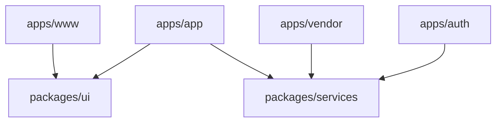

# Frontend Architecture

Bventy's interface layer is built with Next.js 15 and React 19, structured as a Turborepo-powered monorepo for maximum code reuse and deployment flexibility.

## Workspace Architecture

The frontend is divided into independent applications and shared internal packages.

- **Apps (`/apps`)**: Fully isolated Next.js applications deployed to specific subdomains.
- **Packages (`/packages`)**: Shared logic and UI primitives consumed by the applications.

### Dependency Flow

## Core Technologies

- **Next.js 15**: Utilizing the App Router for server-rendered page shells and fast client-side transitions.
- **Tailwind CSS 4**: A utility-first styling system. We use the `@source` directive to scan the shared `@bventy/ui` package for class usage.
- **Radix UI**: Foundational primitives for accessible interactive components (Dialogs, Dropdowns, Tabs).
- **Turborepo**: Manages build caching and task orchestration across the monorepo.

## Component Pattern

We follow a strict hierarchy for components:
1. **Primitives**: Base elements (Button, Input) in `packages/ui`.
2. **Feature Components**: Complex blocks (Navbar, Sidebar) in `packages/ui` that consume primitives.
3. **Application Pages**: Domain-specific views in `apps/*/src/app` that assemble feature components.

---
© 2026 Bventy.
