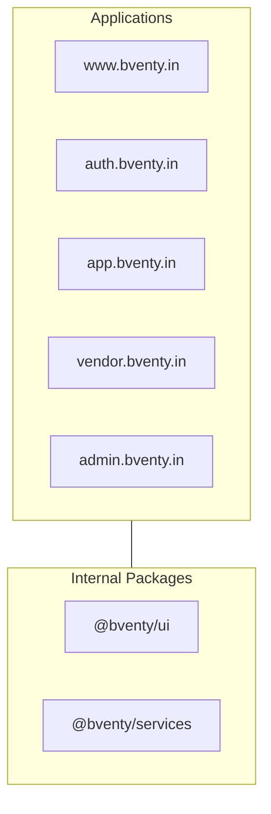
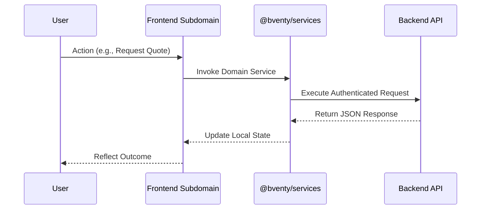

# Architecture Overview

Bventy is engineered as a high-fidelity, high-trust marketplace platform. Our architecture prioritizes professional deliberate interactions over chaotic real-time communication.

## The Monorepo Structure

The platform is managed as a Turborepo-powered monorepo, allowing for strict type-safety and shared design logic across multiple isolated subdomains.

### Application Breakdown

- **www (Marketing)**: Public-facing landing pages and SEO-optimized vendor listings.
- **auth (Identity)**: Centralized authentication server managing JWT issuance and parent-domain session cookies.
- **app (Organizer Hub)**: The primary workspace for event organizers to manage events and quotes.
- **vendor (Provider Portal)**: Dedicated interface for vendors to manage their business profiles and proposal responses.
- **admin (Platform Control)**: Internal tools for moderation, analytics, and system oversight.

## Technical Foundation

- **Framework**: Next.js 15 (App Router)
- **Styling**: Tailwind CSS 4 with a typography-driven design language
- **State & Logic**: Shared React context and custom hooks in `@bventy/services`
- **Session Management**: Domain-wide HTTP-only cookies with URL-based token synchronization for cross-subdomain transitions

## Data Flow

Our data flow is unidirectional and structured. The interface serves as a portal to the backend marketplace logic, ensuring that sensitive contact information remains gated until a formal quote acceptance occurs.

---
© 2026 Bventy.
