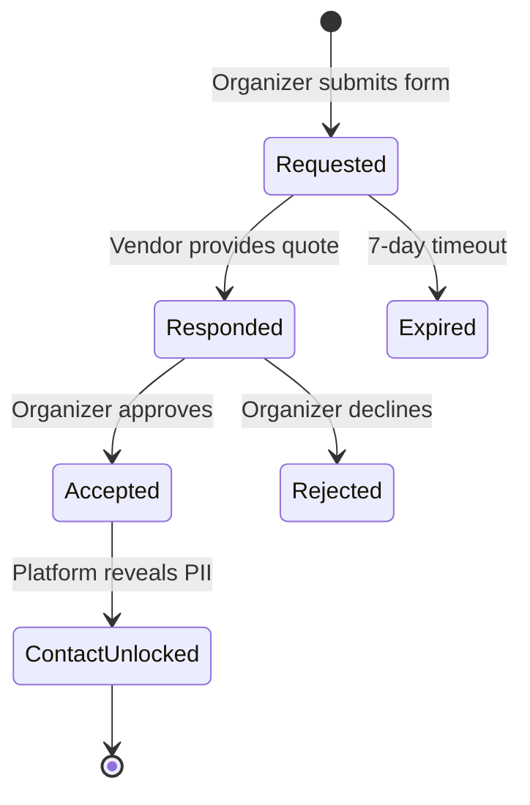

# Marketplace Quote Workflow

Bventy implements a structured negotiation loop designed to minimize ambiguity and protect user privacy.

## The Negotiation Lifecycle

The interaction between an organizer and a vendor follows a strict, state-machine driven process.

### 1. Request Stage
- **Input**: Organizers provide specific event parameters (date, budget, requirements).
- **Status**: `Requested`
- **Visibility**: Backend metadata is visible to the vendor; no contact information is shared.

### 2. Proposal Stage
- **Input**: Vendors evaluate the request and respond with a fixed price or range.
- **Status**: `Responded`
- **UI**: The organizer receives a notification and can view the proposal in their dashboard.

### 3. Decision Stage
- **Outcome A (Accepted)**: The organizer approves the terms. The system automatically transitions to the `Unlocked` state.
- **Outcome B (Rejected)**: The interaction is archived, and the communication channel is closed immediately.

### 4. Fulfillment & Expiry
- **Contact Unlock**: Secure contact information (email, phone) is revealed to both parties for direct collaboration.
- **Automated Archive**: Inactive requests or those past the event date are moved to history to maintain workspace hygiene.

---
© 2026 Bventy.
