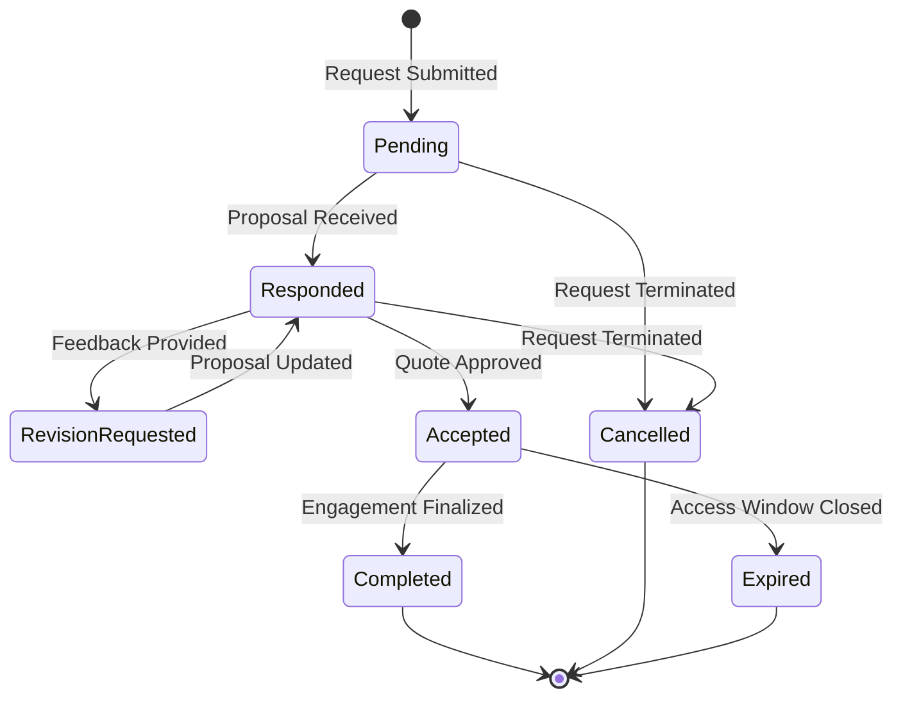

# Quote Lifecycle State Diagram

The frontend UI responds dynamically to the lifecycle of a quote, ensuring users are always guided toward the appropriate action.

## UI Responses by State

- **Pending**: Displaying "Awaiting Vendor Response". Organizers can cancel or edit the heartbeat of the request.
- **Responded**: Highlighting the pricing and vision. Activating the "Accept" and "Request Revision" actions.
- **Accepted**: Revealing "Contact Information". Transitioning the workflow to out-of-platform fulfillment.
- **Expired/Cancelled**: Rendering the quote in a "read-only" history view with clear status indicators.
