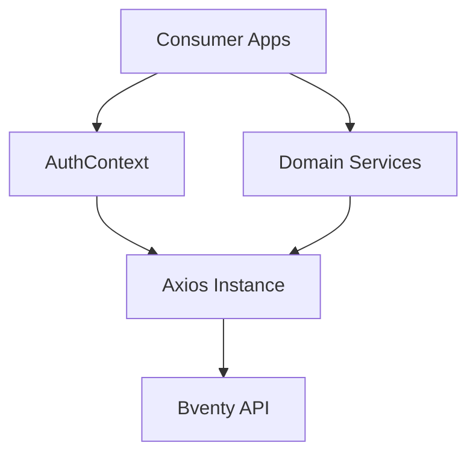

# @bventy/services

Shared business logic, API clients, and authentication state for the Bventy platform.

## Overview

This package centralizes the domain logic and integration points for the Bventy ecosystem. It ensures that authentication state, event management, and vendor interactions are handled consistently across all subdomains.

## Core Modules

- **AuthContext**: Manages JWT sessions with cookie-based hydration and cross-subdomain token sync.
- **userService**: Typed integration for user profiles and account management.
- **eventService**: Logic for event creation, listing, and shortlisting.
- **quoteService**: The core marketplace lifecycle handler (request, response, accept/reject).
- **api**: A configured Axios instance with interceptors for auth and error handling.

## Architecture

## Session Persistence

The services layer implements a hybrid persistence model:
1. **Cookies**: Primary session hydration for cross-subdomain navigation.
2. **LocalStorage**: Secondary token caching for API interceptors.
3. **URL Sync**: Real-time token synchronization when transitioning between subdomains.

---
© 2026 Bventy.
