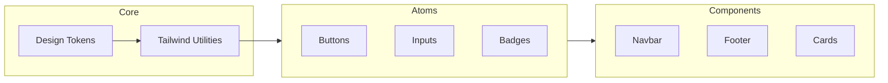

# @bventy/ui

The core design system and component library for the Bventy ecosystem.

## Overview

This package provides a unified, accessible, and performant UI foundation for all Bventy subdomains. It is built on top of **Tailwind CSS 4** and **Radix UI** primitives, ensuring a calm and deliberate user experience.

## Architecture



## Usage

Components should be imported from the `@bventy/ui` workspace prefix:

```tsx
import { Button, Navbar } from "@bventy/ui";
```

## Tailwind Integration

All applications using this package must include its source in their `@source` directive in `globals.css` to ensure styles are correctly generated:

```css
@source "../../../../packages/ui/src/**/*.{ts,tsx}";
```

---
© 2026 Bventy.
